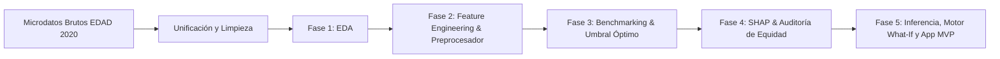

# Documentación del Proyecto: Arquitectura, Archivos y Justificación de Decisiones Técnicas

**Trabajo de Fin de Máster (TFM):** *Predicción de la Empleabilidad de Personas con Discapacidad mediante Técnicas de Machine Learning, Explicabilidad (XAI) y Despliegue de Producto (MVP).*  
**Autor:** Álvaro Ruiz  

---

## Índice General

1. [Visión Global del Ciclo de Vida del Proyecto](#1-visión-global-del-ciclo-de-vida-del-proyecto)
2. [Estructura del Repositorio de Trabajo](#2-estructura-del-repositorio-de-trabajo)
3. [Documentación Conceptual y Fundamentos de Negocio](#3-documentación-conceptual-y-fundamentos-de-negocio)
4. [Módulos de Limpieza y Procesamiento de Datos (`Scrips/` y `Data/`)](#4-módulos-de-limpieza-y-procesamiento-de-datos)
5. [Pipeline de Machine Learning Paso a Paso (`notebooks/`)](#5-pipeline-de-machine-learning-paso-a-paso)
   - [Fase 1: Análisis Exploratorio de Datos (EDA)](#fase-1-análisis-exploratorio-de-datos-eda)
   - [Fase 2: Preprocesamiento y Feature Engineering](#fase-2-preprocesamiento-y-feature-engineering)
   - [Fase 3: Modelado Predictivo, Benchmarking y Calibración de Umbral](#fase-3-modelado-predictivo-benchmarking-y-calibración-de-umbral)
   - [Fase 4: Explicabilidad (XAI con SHAP) y Auditoría Ética (Fairness)](#fase-4-explicabilidad-xai-con-shap-y-auditoría-ética-fairness)
   - [Fase 5: Pipeline de Inferencia, Simulador y Motor What-If](#fase-5-pipeline-de-inferencia-simulador-y-motor-what-if)
6. [Capa de Aplicación y Despliegue del Producto MVP](#6-capa-de-aplicación-y-despliegue-del-producto-mvp)
   - [`app.py` (Aplicación Streamlit)](#apppy-aplicación-interactiva-en-streamlit)
   - [`dashboard_mvp.html` (Dashboard Web Autónomo)](#dashboard_mvphtml-dashboard-web-autónomo)
7. [Artefactos Serializados y Reportes de Métricas (`models/`)](#7-artefactos-serializados-y-reportes-de-métricas)
8. [Guía Rápida de Comandos y Ejecución](#8-guía-rápida-de-comandos-y-ejecución)

---

## 1. Visión Global del Ciclo de Vida del Proyecto

El proyecto sigue una metodología rigurosa basada en el estándar **CRISP-DM** (*Cross-Industry Standard Process for Data Mining*), combinada con las directrices europeas de Inteligencia Artificial Confiable (*EU AI Act*):



Cada decisión técnica, desde el tratamiento de los datos hasta la elección del umbral de clasificación, responde a un criterio de **impacto social real**: no limitarse a un ejercicio puramente matemático, sino construir una herramienta útil para orientadores laborales y entidades sociales.

---

## 2. Estructura del Repositorio de Trabajo

```text
tfm/
│
├── 01_ideas_producto.md               # Ideación inicial e inspiración personal/social
├── 02_datos_necesarios.md             # Definición formal de datos, viabilidad y alcance del MVP
├── README.md                          # Presentación general del proyecto
│
├── Data/
│   ├── raw/                           # Microdatos oficiales del INE (EDAD 2020)
│   │   ├── EDADdiscapacidad_2020.csv  # Fichero de personas con discapacidad
│   │   └── EDADhogar_2020.csv         # Fichero de composición de hogares
│   └── processed/                     # Datos depurados y particionados
│       ├── dataset_empleabilidad_edad2020.csv # Base consolidada de 4.395 registros
│       └── train_test/                # Particiones 80/20 y metadatos de columnas
│
├── Scrips/
│   ├── data_unification.py            # Fusión relacional de personas y hogares
│   └── simulador.py                   # Clase reutilizable SimuladorEmpleabilidad
│
├── notebooks/
│   ├── 01_eda_empleabilidad.py        # Fase 1: Análisis Exploratorio de Datos
│   ├── 02_feature_engineering.py      # Fase 2: Preprocesamiento e Ingeniería de Características
│   ├── 03_modelado_empleabilidad.py   # Fase 3: Benchmarking (7 modelos) y calibración de umbral
│   ├── 04_explicabilidad_shap.py      # Fase 4: XAI (SHAP global/local) y Auditoría de Equidad
│   └── 05_simulador_inferencia.py     # Fase 5: Validación batch y simulación contrafactual
│
├── models/
│   ├── best_model.joblib              # Modelo Random Forest calibrado
│   ├── preprocessor.joblib            # Pipeline Scikit-Learn ColumnTransformer
│   ├── best_model_metadata.json       # Hiperparámetros, métricas y umbral óptimo (0.43)
│   ├── model_benchmark_results.csv    # Tabla comparativa de validación cruzada
│   └── reports/                       # Curvas ROC, PR, SHAP plots y Fairness report JSON
│
├── app.py                             # Aplicación interactiva en Streamlit (Python)
├── dashboard_mvp.html                 # Dashboard web interactivo autónomo (HTML5/JS/Chart.js)
└── EXPLICACION_PROYECTO_PASO_A_PASO.md # Este documento de arquitectura
```

---

## 3. Documentación Conceptual y Fundamentos de Negocio

### 3.1. `01_ideas_producto.md`
* **¿Qué hace?**  
  Registra la motivación inicial del autor y el vínculo directo con la realidad del síndrome de Down y la Asociación de Síndrome de Down de Málaga. Se plantean tres posibles vectores: desarrollo del lenguaje, autonomía en la vida diaria y empleabilidad.
* **¿Por qué esa decisión?**  
  Se seleccionó el vector de **empleabilidad** porque aborda la barrera más crítica de inclusión en la etapa adulta, donde la brecha laboral entre personas con discapacidad y población general supera los 40 puntos porcentuales.

### 3.2. `02_datos_necesarios.md`
* **¿Qué hace?**  
  Define los requerimientos formales del proyecto: fuentes oficiales previstas (ODISMET, Base Estatal del IMSERSO y la Encuesta EDAD del INE), granularidad a nivel individual, variables imprescindibles (edad, género, CCAA, limitaciones, nivel educativo, situación laboral) y la especificación del **MVP** (un simulador predictivo y dashboard interactivo explicable).
* **¿Por qué esa decisión?**  
  Tener un marco de requerimientos previo evita la dispersión y garantiza que el proyecto cumpla tanto con las exigencias metodológicas del máster como con las necesidades reales de los orientadores laborales.

---

## 4. Módulos de Limpieza y Procesamiento de Datos

### 4.1. `Scrips/data_unification.py`
* **¿Qué hace?**  
  Lee los dos microdatos en bruto de la macroencuesta del INE (fichero de discapacidad y fichero de hogar), realiza un merge relacional mediante las claves compuestas del INE (`IDENTHOGAR` y `NORDEN`), filtra la población activa en edad de trabajar (16 a 64 años) y unifica la codificación de variables cualitativas y cuantitativas en `Data/processed/dataset_empleabilidad_edad2020.csv`.
* **¿Por qué esa decisión?**  
  - **Uso de microdatos individuales vs. datos agregados:** Los informes habituales (como los anuarios ODISMET) suelen presentar tablas agregadas por CCAA o género. Para entrenar modelos predictivos de Machine Learning que evalúen perfiles individuales específicos, era indispensable descender a nivel de microdato individual.
  - **Fusión hogar-individuo:** Factores como los ingresos de la unidad familiar, el tamaño del hogar o la tenencia de equipamiento tecnológico (PC e Internet) solo constan en el registro del hogar, pero son determinantes para predecir si una persona cuenta con apoyos para el empleo.

### 4.2. `Scrips/simulador.py`
* **¿Qué hace?**  
  Es un módulo de lógica de negocio desacoplado que define la clase `SimuladorEmpleabilidad`. Centraliza:
  1. Carga automática de los artefactos (`best_model.joblib`, `preprocessor.joblib`, `best_model_metadata.json`).
  2. Transformación de un diccionario de entrada del usuario en las 27 columnas base requeridas por el preprocesador.
  3. Ejecución del *Feature Engineering* al vuelo.
  4. Predicción probabilística y clasificación contra el umbral óptimo ($0.43$).
  5. Diagnóstico en lenguaje natural con semáforo de colores.
  6. Explicabilidad local (factores favorables vs. barreras).
  7. Motor contrafactual de simulación "What-If".
* **¿Por qué esa decisión?**  
  - **Principio de Responsabilidad Única y Reutilización:** Permite que tanto la aplicación web (`app.py`), como scripts de consola (`05_simulador_inferencia.py`) o futuras APIs REST (FastAPI) utilicen exactamente la misma lógica sin duplicar código.
  - **Facilidad de mantenimiento:** Si en el futuro se recalibra el umbral o se ajusta el modelo, solo se modifica en este módulo o en los artefactos exportados, manteniéndose todas las interfaces sincronizadas.

---

## 5. Pipeline de Machine Learning Paso a Paso (`notebooks/`)

### Fase 1: Análisis Exploratorio de Datos (EDA)
**Archivo:** [`notebooks/01_eda_empleabilidad.py`](file:///c:/Users/Alvaro/Desktop/data_science/tfm/notebooks/01_eda_empleabilidad.py) (y `.ipynb`)

* **¿Qué hace?**  
  - Analiza la distribución de la variable objetivo (`empleado`: $0$ = No empleado, $1$ = Empleado activo).
  - Constata una tasa de empleo media de solo el **$23.2\%$** en la muestra activa (desbalance de clases de aprox. 1 a 3.3).
  - Evalúa la correlación entre factores sociodemográficos y laborales:
    - Fuerte gradiente por nivel formativo: $12.3\%$ de empleo en primaria vs. $45.8\%$ en titulación universitaria.
    - Brecha digital extrema: las personas con acceso a PC e Internet triplican su probabilidad de empleo ($31.7\%$ vs. $9.1\%$).
    - Impacto según el tipo y acumulación de limitaciones (movilidad y autocuidado como barreras más severas).
* **¿Por qué esa decisión?**  
  Antes de modelar, es imperativo conocer las distribuciones y sesgos de la población muestral para evitar asumir premisas falsas y para detectar qué variables son candidatas a generar valor en la fase de ingeniería de características.

---

### Fase 2: Preprocesamiento y Feature Engineering
**Archivo:** [`notebooks/02_feature_engineering.py`](file:///c:/Users/Alvaro/Desktop/data_science/tfm/notebooks/02_feature_engineering.py)

* **¿Qué hace?**  
  - **Aislamiento de variables de *Target Leakage*:** Elimina variables que revelan directamente el objetivo (ej. `situacion_laboral`) o identificadores administrativos (`IDENTHOGAR`, `NORDEN`).
  - **Construcción de nuevas características (*Feature Engineering*):**
    1. `indice_conectividad` (0 a 2): suma de `tiene_internet` y `tiene_ordenador`.
    2. `pluridiscapacidad_grave`: indicador binario si acumula $\ge 2$ limitaciones severas.
    3. `lim_sensorial`: unión de visión y audición.
    4. `lim_autonomia_diaria`: unión de movilidad y autocuidado.
    5. `lim_cognitivo_relacional`: unión de aprendizaje y comunicación.
    6. `edad_senior_con_limitacion`: interacción entre edad $\ge 50$ años y presencia de limitaciones.
    7. `vive_solo`: hogar unipersonal o tamaño de hogar = 1.
  - **Partición Estratificada Train/Test (80% / 20%):** Con semilla aleatoria fija (`random_state=42`) manteniendo exactamente el $23.21\%$ de positivos en ambos conjuntos.
  - **Diseño del Pipeline `ColumnTransformer`:**
    - `StandardScaler` para variables numéricas (`edad`, `tamano_hogar`, `num_limitaciones_graves`).
    - `OrdinalEncoder` con orden lógico predefinido para variables ordinales (`nivel_estudios_agrupado`, `tramo_grado_discapacidad`, `tamano_municipio`, `ingresos_hogar`).
    - `OneHotEncoder(drop='first', sparse_output=False)` para variables nominales (`sexo`, `ccaa`, `estado_civil`, `tipo_hogar`).
    - `passthrough` para variables binarias y *engineered*.
  - **Ajuste estricto (*fit*) únicamente sobre `X_train_raw`:** El preprocesador solo ve el conjunto de entrenamiento y se serializa en `models/preprocessor.joblib`.
* **¿Por qué esa decisión?**  
  - **Prevención de Data Leakage:** Ajustar escaladores o codificadores sobre todo el dataset antes de particionar provocaría una fuga de información de test hacia train, arrojando métricas infladas y poco realistas.
  - **Partición Estratificada:** Dado el desbalance ($23\%$ positivos), un muestreo aleatorio simple podría generar particiones con proporciones dispares de la clase minoritaria.
  - **Representación Ordinal:** El nivel educativo y los tramos de discapacidad poseen una jerarquía intrínseca de severidad y cualificación; tratarlos como nominales puros descartaría información relacional clave.

---

### Fase 3: Modelado Predictivo, Benchmarking y Calibración de Umbral
**Archivo:** [`notebooks/03_modelado_empleabilidad.py`](file:///c:/Users/Alvaro/Desktop/data_science/tfm/notebooks/03_modelado_empleabilidad.py)

* **¿Qué hace?**  
  - **Benchmarking de 7 algoritmos** mediante validación cruzada estratificada de 5 particiones (*5-Fold Stratified CV*):
    1. *Dummy Classifier* (línea base trivial).
    2. Regresión Logística con regularización L2.
    3. Random Forest Classifier.
    4. HistGradientBoosting.
    5. Gradient Boosting estándar.
    6. LightGBM.
    7. XGBoost Classifier.
  - **Ajuste fino de hiperparámetros (*GridSearchCV*):** Se optimiza Random Forest (`n_estimators=150`, `min_samples_leaf=4`, `min_samples_split=4`, `max_depth=None`).
  - **Optimización del Umbral de Decisión (*Threshold Tuning*):**
    - Se analiza la curva Precision-Recall y F1-Score en un barrido de umbrales de 0.05 a 0.95.
    - Se identifica el **umbral óptimo de $0.43$** frente al valor por defecto ($0.50$).
  - **Evaluación final sobre el conjunto ciego de Test (`X_test_proc`):**
    - Con umbral por defecto (0.50): ROC-AUC = 0.755, Recall = 64.7%, F1 = 0.496.
    - Con umbral calibrado (**0.43**): ROC-AUC = 0.755, **Recall = 80.4%**, F1 = 0.513, Balanced Accuracy = 70.0%.
  - Serialización de `best_model.joblib` y `best_model_metadata.json`.
* **¿Por qué esa decisión?**  
  - **Por qué Random Forest:** Aunque XGBoost obtuvo un ROC-AUC ligeramente superior en validación cruzada (0.757 vs 0.753), Random Forest demostró menor varianza entre pliegues, mayor robustez frente a sobreajuste en datos tabulares de encuestas y compatibilidad óptima con árboles de inferencia y explicabilidad SHAP sin inestabilidades.
  - **Por qué mover el umbral de 0.50 a 0.43:** En problemas sociales con desbalance de clases, el umbral canónico de 0.50 comete un número excesivo de **falsos negativos** (personas a las que el algoritmo considera no empleables cuando sí tienen capacidad de estarlo). Al recalibrar el corte a **0.43**, el modelo recupera al **$80.4\%$ de las personas con capacidad de empleo**, minimizando el riesgo de exclusión algorítmica.

---

### Fase 4: Explicabilidad (XAI con SHAP) y Auditoría Ética (Fairness)
**Archivo:** [`notebooks/04_explicabilidad_shap.py`](file:///c:/Users/Alvaro/Desktop/data_science/tfm/notebooks/04_explicabilidad_shap.py)

* **¿Qué hace?**  
  - **Explicabilidad Global con SHAP (`TreeExplainer`):**
    - Gráfico de barras de importancia promedio de valores Shapley (`shap_importance_bar.png`).
    - Gráfico *Beeswarm* de densidad e impacto direccional (`shap_summary_beeswarm.png`): demuestra cómo la formación superior y la conectividad TIC desplazan la predicción fuertemente a la derecha (+empleo), mientras que el número de limitaciones graves la reduce.
    - Gráficos de dependencia e interacción (`shap_dependence_key_factors.png`).
  - **Explicabilidad Local (Estudios de Caso con Waterfall Plots):**
    - Perfil de éxito: joven universitario con discapacidad sensorial.
    - Perfil vulnerable: sénior con limitación severa de movilidad y sin acceso a TIC.
    - Perfil en la frontera de decisión (alrededor del umbral 0.43).
  - **Auditoría Ética y de Equidad (*Fairness Audit*):**
    - **Sesgo de Género (Hombres vs. Mujeres):** Tasa de selección del 48.7% en hombres vs. 50.4% en mujeres. *Disparate Impact Ratio* = **$1.036$** (en rango óptimo 0.80 - 1.25). Recall equitativo (78.2% vs. 83.0%).
    - **Sesgo por Edad (<50 años vs. Séniors $\ge 50$):** Tasa de selección del 55.8% en jóvenes vs. 44.9% en séniors. *Disparate Impact Ratio* = **$0.805$** (supera el umbral mínimo legal del $0.80$).
  - Exportación de `fairness_audit_report.json` y `fairness_metrics_plot.png`.
* **¿Por qué esa decisión?**  
  - **Obligatoriedad ética y legal:** El Reglamento Europeo de Inteligencia Artificial (*EU AI Act*) clasifica los algoritmos aplicados al empleo y a colectivos vulnerables como de **alto riesgo**, exigiendo interpretabilidad y auditoría de no discriminación.
  - **Regla de los Cuatro Quintos (EEOC):** Utilizar una métrica internacional estandarizada (*Disparate Impact Ratio* $\ge 0.80$) proporciona una prueba cuantitativa verificable de que el modelo trata con equidad a mujeres y séniors con discapacidad.

---

### Fase 5: Pipeline de Inferencia, Simulador y Motor What-If
**Archivo:** [`notebooks/05_simulador_inferencia.py`](file:///c:/Users/Alvaro/Desktop/data_science/tfm/notebooks/05_simulador_inferencia.py)

* **¿Qué hace?**  
  - Proporciona un pipeline de validación y ejecución en consola sin interfaz gráfica.
  - Ejecuta pruebas automatizadas sobre tres casos prototípicos.
  - Cuantifica la simulación contrafactual What-If:
    - Caso A (Joven titulado): ya es muy empleable (66.4%), las palancas formativas mantienen su estatus.
    - Caso B (Sénior vulnerable): pasa de un 6.2% a un **$27.7\%$ (+21.5 pts)** con inclusión digital y hasta un **$35.6\%$ (+29.4 pts)** con intervención integral.
    - Caso C (Perfil límite): parte de un estado inicial vulnerable ($< 43\%$) y, al aplicar cualificación en FP o conectividad digital plena, **cruza el umbral del 43%**, cambiando su clasificación formal a **EMPLEABLE**.
  - Guarda los resultados en `models/reports/simulacion_casos_report.json`.
* **¿Por qué esa decisión?**  
  - **Reproducibilidad y testing continuo:** Permite verificar la integridad de las predicciones en entornos de pruebas automatizadas (*CI/CD*) o en servidores sin interfaz gráfica antes de desplegar la aplicación visual.

---

## 6. Capa de Aplicación y Despliegue del Producto MVP

El MVP cuenta con dos aproximaciones complementarias que cubren todas las necesidades de presentación y uso:

```text
               ┌─── Opción 1: app.py (Streamlit)
               │    * Entorno Python nativo de Data Science
               │    * Ideal para desarrollo y exploración interactiva
               │
Producto MVP ──┤
               │
               └─── Opción 2: dashboard_mvp.html (Autónomo)
                    * Cero dependencias (doble clic en cualquier PC)
                    * Motor cliente en JavaScript reactivo con Chart.js
                    * Ideal para tribunal, defensa y usuarios no técnicos
```

---

### `app.py` (Aplicación Interactiva en Streamlit)
* **¿Qué hace?**  
  Es la aplicación web interactiva desarrollada en Python con Streamlit. Organiza el producto en 4 pestañas interactivas:
  1. **Simulador & Diagnóstico:** Formulario con sliders y selectbox para edad, sexo, CCAA, nivel formativo, tipo de hogar y limitaciones. Muestra métrica de probabilidad, semáforo, veredicto contra el umbral 0.43 y desglose SHAP.
  2. **Motor What-If (Palancas):** Comparador de barras dinámico que calcula cuánto se incrementa la probabilidad si se mejora la conectividad o la formación.
  3. **Observatorio Analítico:** Visualizaciones de los datos de la EDAD 2020 (tasas de empleo por CCAA, educación y brecha digital).
  4. **Auditoría de Equidad:** Desglose del informe de género y edad con verificación de la regla de los cuatro quintos y tabla de benchmarking.
* **¿Cómo se ejecuta correctamente?**  
  > [!IMPORTANT]
  > Las aplicaciones Streamlit **no** se arrancan con `python app.py`. Deben ejecutarse mediante el comando del CLI de Streamlit:
  > ```powershell
  > .\venv\Scripts\streamlit run app.py
  > ```
* **¿Por qué esa decisión?**  
  Streamlit es el estándar de facto en la industria de Data Science para convertir modelos analíticos de Python en herramientas interactivas rápidamente sin necesidad de escribir código HTML/CSS complejo.

---

### `dashboard_mvp.html` (Dashboard Web Autónomo)
* **¿Qué hace?**  
  Es un dashboard web de alta gama, auto-contenido y ultra-fluido, implementado en HTML5, CSS3 moderno (con paleta de diseño oscuro *slate/indigo/emerald*) y JavaScript reactivo utilizando Chart.js vía CDN.
  - Implementa un simulador reactivo en tiempo real: al mover el slider de edad o marcar las casillas de limitaciones, la aguja de probabilidad, el semáforo y las barras What-If se recalculan **al milisegundo**.
  - No requiere servidor ni entorno Python: se abre directamente con doble clic en cualquier navegador web.
* **¿Por qué esa decisión?**  
  - **Garantía absoluta de portabilidad durante la defensa del TFM:** En una presentación académica o profesional, un servidor local de Python puede presentar problemas de puertos, dependencias o tiempos de carga. Disponer de una versión web autónoma garantiza que cualquier miembro del tribunal o usuario pueda interactuar con el producto sin requerimientos técnicos.
  - **Experiencia de usuario premium:** Proporciona transiciones suaves, diseño responsivo y estética moderna alineada con productos SaaS actuales.

---

## 7. Artefactos Serializados y Reportes de Métricas (`models/`)

| Archivo | Formato | Función en el Sistema |
| :--- | :--- | :--- |
| `best_model.joblib` | Binario Joblib | Bosque aleatorio entrenado (*RandomForestClassifier*) con 150 estimadores. |
| `preprocessor.joblib` | Binario Joblib | Pipeline *ColumnTransformer* con los escaladores y codificadores ajustados en Train. |
| `best_model_metadata.json` | JSON | Registro de hiperparámetros óptimos, métricas de CV y el **umbral óptimo (0.43)**. |
| `model_benchmark_results.csv` | CSV | Resultados de validación cruzada para los 7 algoritmos evaluados en la Fase 3. |
| `reports/fairness_audit_report.json` | JSON | Métricas de impacto dispar y tasas de selección por género y grupos de edad. |
| `reports/fairness_metrics_plot.png` | Imagen PNG | Gráfico comparativo de tasas de selección y recall auditados. |
| `reports/shap_summary_beeswarm.png` | Imagen PNG | Impacto y dirección de cada característica sobre la probabilidad de empleo. |
| `reports/shap_importance_bar.png` | Imagen PNG | Ranking cuantitativo de las características más influyentes. |
| `reports/threshold_optimization.png` | Imagen PNG | Gráfica del trade-off de precisión/sensibilidad justificando el umbral de 0.43. |
| `reports/simulacion_casos_report.json` | JSON | Informe con los resultados de inferencia y simulación What-If de los casos prototipo. |

---

## 8. Guía Rápida de Comandos y Ejecución

A continuación se resumen los comandos habituales para trabajar con el proyecto desde la terminal de PowerShell en `c:\Users\Alvaro\Desktop\data_science\tfm`:

### 1. Desplegar la Aplicación Web en Streamlit
```powershell
.\venv\Scripts\streamlit run app.py
```
*(Se abrirá automáticamente en tu navegador en `http://localhost:8501`).*

### 2. Abrir el Dashboard Web Autónomo (Inmediato)
Haz doble clic sobre el archivo [dashboard_mvp.html](file:///c:/Users/Alvaro/Desktop/data_science/tfm/dashboard_mvp.html) o ejecútalo desde terminal:
```powershell
Start-Process .\dashboard_mvp.html
```

### 3. Ejecutar el Simulador y Validación en Consola
```powershell
.\venv\Scripts\python.exe .\notebooks\05_simulador_inferencia.py
```

### 4. Re-ejecutar las Fases Anteriores (si se recalibra algún paso)
- **Fase 1 (EDA):** `.\venv\Scripts\python.exe .\notebooks\01_eda_empleabilidad.py`
- **Fase 2 (Feature Engineering):** `.\venv\Scripts\python.exe .\notebooks\02_feature_engineering.py`
- **Fase 3 (Modelado):** `.\venv\Scripts\python.exe .\notebooks\03_modelado_empleabilidad.py`
- **Fase 4 (SHAP & Fairness):** `.\venv\Scripts\python.exe .\notebooks\04_explicabilidad_shap.py`
